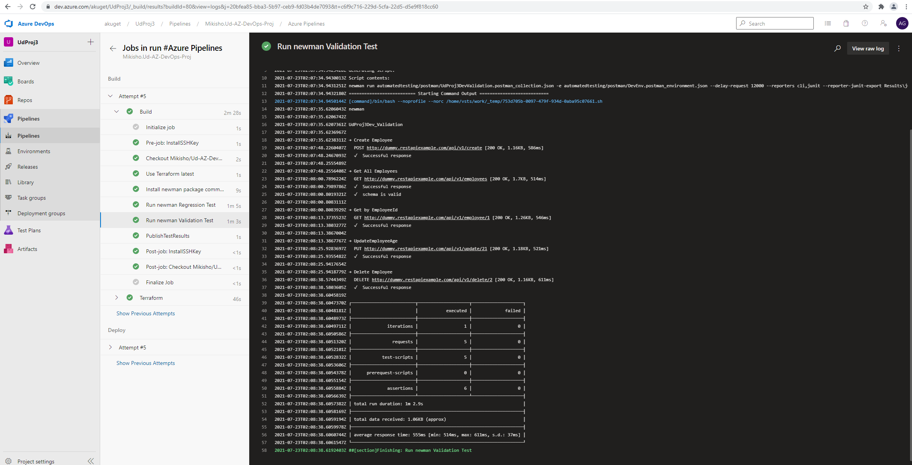

# Udacity-Azure-DevOps

# Overview

This project is done to fullfill Udacity A Cloud DevOps Using Microsoft Azure Nano Degree program.

In this Project, disposabale test environments and variety of automated tests were done using industry leading tools. In addition, moitoring tools are also used inorder to provide insight into an application's behaviour, and detrmine the root causes using Azure log Analytics.

# Project Tools and Environment 

In this project, the following tools were used 

* Azure DevOps
* Postman
* Terraform 
* JMeter 
* Selenium 

# Screenshots

* Azure Pipeline

## Stages of pipeline

* Terraform 

* Postman test results

* Jmeter test results 

Endurance Test

Stress Test

* Selenium test results

Custom Logs 

* Azure alert setup 

Cpu usage alert

* Azure alert Email notification setup 

